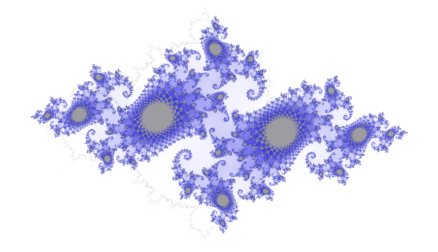

# julia

 

[Animated Julia sets](https://friarswood.net) and a [zoomable Mandelbrot set](https://friarswood.net/mandel.html), implemented in rust and webassembly.

This version is a barebones reworking of a previous implementation that was beset by node.js vulnerabilities.

Based on the tutorial [here](https://wasmbyexample.dev). Doesn't require node.js or webpack.

## build

```sh
wasm-pack build --target web --no-typescript
```

## run locally

Use a proper web server for prod. For local dev:

```sh
python3 -m http.server
```

## test (on firefox)

```sh
firefox --private-window localhost:8000
```

`F12` opens debug console

## package/deploy

Uses the nginx docker image:

```sh
docker build -t julia .
docker run -it -d -p 80:80 julia:latest
```
